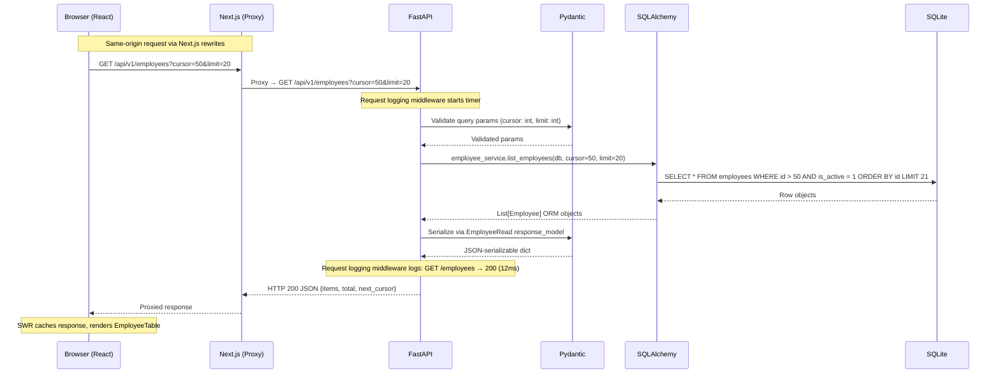
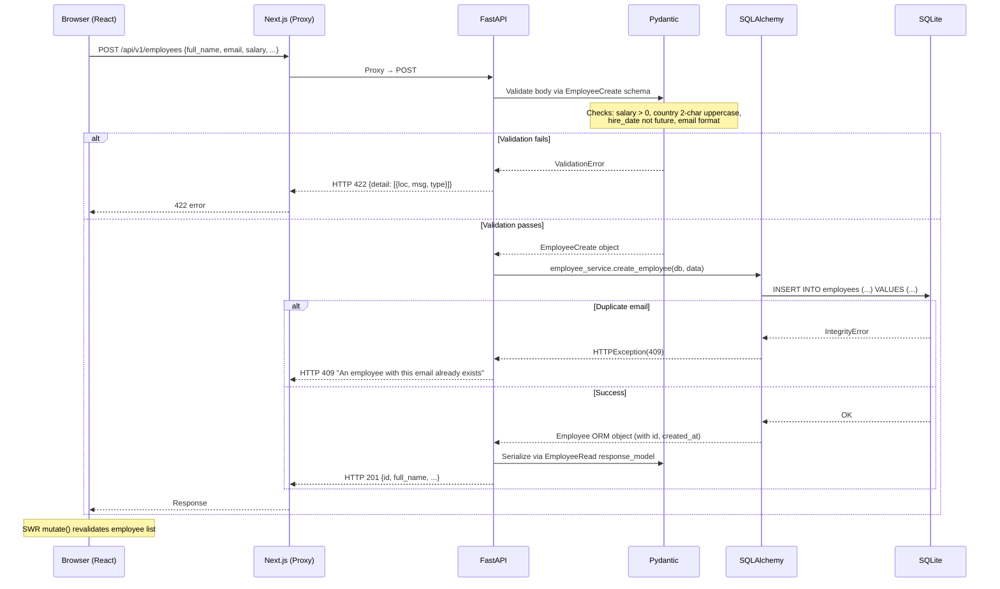

# Data Flow Diagram

## Request/Response Flow

The following diagram shows the complete data flow for a typical API request, from browser to database and back.

## Write Flow (Create Employee)

## Validation Boundaries

| Layer | What is validated |
|-------|-------------------|
| **Browser (Zod)** | Client-side: salary > 0, country format, email format, hire_date not future. Provides instant feedback. |
| **FastAPI (Pydantic)** | Server-side: identical rules as Zod + EmailStr validation. Authoritative — never trust the client. |
| **SQLAlchemy** | Schema-level: NOT NULL, UNIQUE email, FK constraints. Last line of defense. |
| **SQLite** | Storage-level: data types, index enforcement. |
