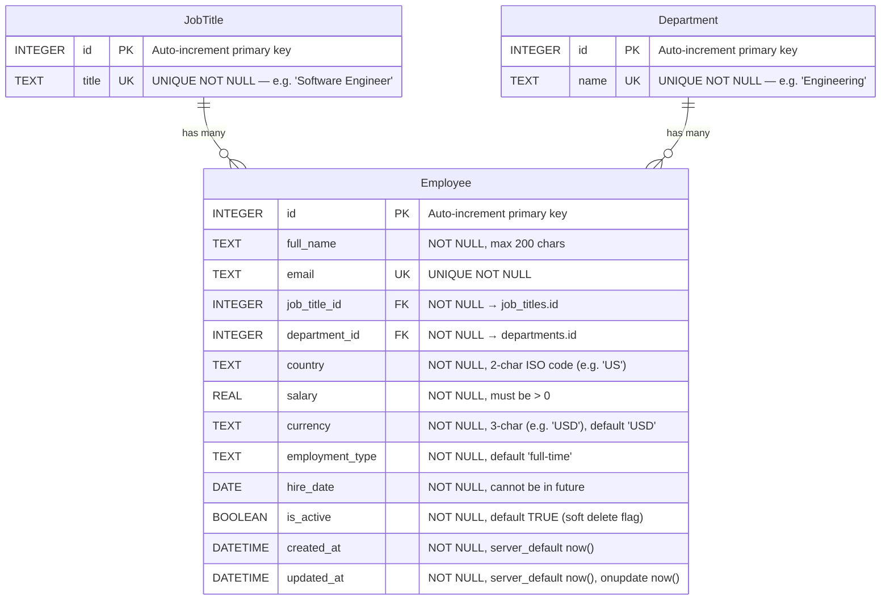

# Entity-Relationship Diagram

## Indexes

| Index Name | Table | Columns | Purpose |
|------------|-------|---------|---------|
| `PRIMARY KEY` | `employees` | `id` | Row lookup, keyset pagination cursor |
| `UNIQUE` | `employees` | `email` | Prevent duplicate employee records |
| `ix_emp_country` | `employees` | `country` | Filter/group by country in analytics |
| `ix_emp_jt_country` | `employees` | `job_title_id, country` | Composite: salary-by-job-title-in-country |
| `ix_emp_active` | `employees` | `is_active` | Filter active/inactive employees |
| `UNIQUE` | `job_titles` | `title` | Prevent duplicate titles |
| `UNIQUE` | `departments` | `name` | Prevent duplicate departments |

## Cardinalities

- **JobTitle → Employee**: One-to-many. Each job title can have many employees. Each employee has exactly one job title.
- **Department → Employee**: One-to-many. Each department can have many employees. Each employee belongs to exactly one department.
